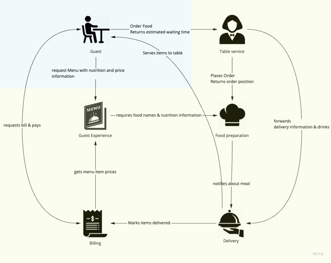

# The Restaurant Kata

A Kata for building and learning about distributed systems, inspired by [Greg Young](https://twitter.com/gregyoung)s restaurant example.

Imagine the following: you are entering a restaurant to order some food and drinks.
You pick up the menu from the table, study it and after you found your meal, you contact the waitress to order a Wiener Schnitzel and a soda.
After a while the assistant manager brings you the food, which was deliciously prepared by the cook.
Once you are finished,you ask for the bill, pay in cash and leave this nice place.

In this setting we have a user, the guest, who is interacting with a system.
This system consists of a lot of different actors, who are working together to fulfill the users needs.
Each actor executes several tasks within their job, while they interact with other actors.

## Actors within our system

In this section we describe the actors and their responsibilities in our restaurant.
The following image gives you a coarse overview on how they are connected.

### The guest - representing a system user

The customer - the guest - is hungry and thirsty and visits the restaurant for food and drinks.
Guests represent outside users, who are interacting with the system:

- request the menu, containing products with nutrition information
- issues orders with the waiter for the selected products from the menu
- waits to receive food and drinks
- requests the bill and pays

### Guest experience - creating a pleasant visit

A manager designs the menu, which describes all the items served by the restaurant.

- the menu with all of the items is presented to a customer. A item of the menu has a name, a nutrition information and a price.
- to ensure the nutrition information is up-to-date with the ingredients served, details about them are retrieved from the cook.
- the cashier asks for current item prices

### Table service - helping the guest at the table

A waitress/waiter interacts with the guest, who orders items from the menu.

- takes the order for several menu items from guests
- forwards the food order to the food preparation
- responds to the customer with an estimated waiting time based on information from the cook and his experience
- forwards drink orders to delivery

### Food preparation - cooking a delicious meal

A cook prepares meals in the order they are requested.

- order for single menu items can be placed
- a meal preparation takes a defined time (calculated by the number of ingredients * 2, e.g. a meal with 4 ingredients takes 8 seconds to prepare)
- you have a limited amount of cooks available (e.g. only 2 cooks can prepare meals and they are blocked for the preparation time)
- the number of meals that are prepared before the requested one is returned (e.g. if two meals are about to prepared and another order is requested, food preparation would return 3)
- when a meal is prepared (after it's preparation time) it is placed on the counter and delivery is notified
- provides a list of cookable meals with name and nutrition information

### Delivery - serving items

In delivery an assistant manager ensures that all ordered items are delivered on time to the guest and that they are registered for billing.

- watches for prepared meals from the cook and picks them up
- prepares drinks
- delivers items to the guest
- registers delivered items with the cashier

### Billing - managing payment and money

The cashier keeps track of items a guest ordered and generates a bill.

- knows food prices from the managers menu
- keeps track of delivered items for a customer
- generates a bill for the guest
- marks bill as payed

## Part 1 - Building the system in a naive way

The goal of the first exercise is to build each actor as a standalone application and connect them together to form a distributed system.
We focus on bringing value to the guest, while learning about the rules and the behavior of the system we develop.

To keep things simple from a technical point of view, the following guidelines should be respected:

- each actor is implemented as independent runnable application, and it can be started with a simple CLI command
- configuration parameters of an application can be set/overridden via environment variables
- all communication is done via unsecured HTTP and the exposed port can be configured via a dedicated environment variable (e.g. `PORT` or `ASPNETCORE_URLS`)
- logs messages are written to the console / STDOUT

### Starting points

The guest is simulated and expects the following contracts to be implemented by the  following services:

- The customer exposes some endpoints described [here](services/Customer.yaml), which are called by other systems
- [Guest experience](services/GuestExperience.yaml), [Table Service](services/TableService.yaml) and [Billing](services/Billing.yaml) define contracts that are called by the customer

A documentation from the description files can be generated by following this [readme](./services/Readme.md)